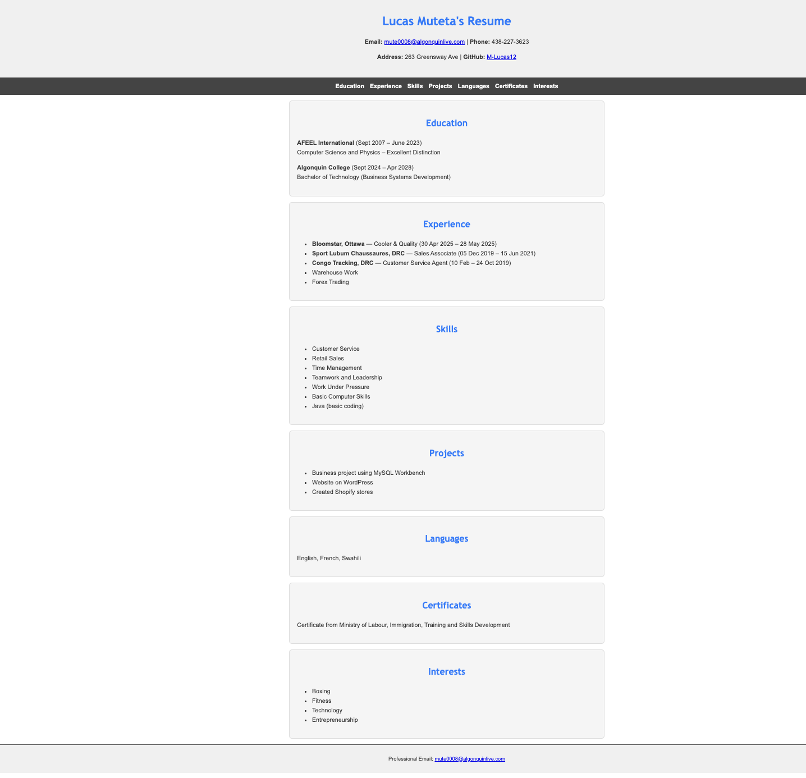

# 🎨 Design System – Resume Project
**Course:** CST3106  
**Lab:** 04  
**Student:** Lucas Muteta

---

## 🧱 Layout Overview
The resume webpage follows a **single-page structure** divided into:
- Header with name and contact info
- Navigation bar
- Education, Experience, Skills, Projects, and Languages sections
- Footer with copyright

**Screenshot:**  


---

## 🎨 Color Palette
| Purpose | Color | Hex | Use |
|----------|-------|------|-----|
| Primary | Deep Blue | `#007BFF` | Headings / links |
| Text | Charcoal | `#333333` | Paragraph text |
| Background | White | `#FFFFFF` | Page background |
| Accent | Slate Gray | `#555555` | Borders / sub-text |
| Highlight | Light Gray | `#F5F5F5` | Section backgrounds |

```css
:root {
  --primary-color: #007BFF;
  --text-color: #333333;
  --accent-color: #555555;
  --background-color: #FFFFFF;
  --highlight-color: #F5F5F5;
}